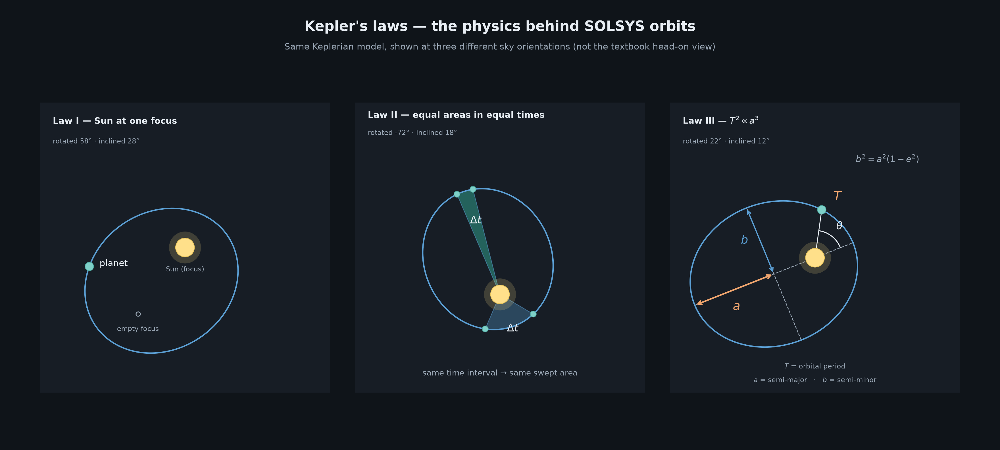

# SOLSYS



**SOLSYS** visualizes the solar system with corrected Keplerian physics — from the inner planets out past the Kuiper Belt and Oort Cloud to nearby stars.

The **main product** is animation: light/dark GIFs of the inner system and a staged 3D zoom from the Oort cloud inward. A **side product** renders static multi-zoom JPGs (light/dark) and a light-year neighborhood star map. Shared libraries hold orbit math, catalogs, and asteroid-population motion so both products stay in sync.

Built with `numpy`, `pandas`, and `matplotlib`. Orbital elements include elliptical planet orbits, spherical asteroid/Kuiper/Oort shells, Jupiter Trojans/Greeks, Hilda clusters, moons, named asteroids, and `'Oumuamua`'s hyperbolic trajectory from JPL elements.

## What's included

| Layer | Path | Role |
|-------|------|------|
| CLI | `render.py` | Single entry point: `animate` / `static` / `neighborhood` / `all` |
| Main product | `animate/` | GIF animations (2D inner system + 3D zoom tour); Blender close-ups planned under `animate/scenes/blender/` |
| Side product | `static/` | Multi-zoom JPGs light/dark (2D top-down / 3D) and neighborhood star map |
| Shared physics | `solsys/physics/` | Constants, orbits, catalogs, belt generators, view registry |
| Shared motion | `solsys/motion/` | Animated asteroid / Hilda / Trojan / Kuiper / Oort populations |

**Outputs**

- Main: `output/animate/2d/`, `output/animate/3d/`
- Side: `output/2d/`, `output/3d/`, `output/neighborhood/`

## File structure

```text
SOLSYS/
├── render.py                                      # CLI entry point
├── requirements.txt
├── requirements-dev.txt                           # pre-commit, ruff, radon, xenon
├── pyproject.toml                                 # Ruff config
├── .pre-commit-config.yaml                        # Git hook definitions
├── .githooks/
│   └── commit-msg                                 # type(SOLSYS[-N]): subject
├── README.md
├── docs/
│   ├── keplers_three_laws.png                     # Kepler laws diagram
│   └── generate_keplers_laws_figure.py            # Regenerates the diagram
├── data/
│   ├── nearby_stars_30.csv                        # Nearby-star catalog (RA/Dec, distances, system_id)
│   ├── systems.csv                                # Star systems (sol, alpha_centauri, …)
│   ├── stellar_orbits.csv                         # Multi-star orbits vs system barycenter
│   └── planets.csv                                # Exoplanets linked by host_star_uuid
│
├── animate/                                       # MAIN PRODUCT — GIF animations
│   ├── __init__.py
│   ├── solar_system_animator.py                   # SolarSystemAnimator, renderAllAnimations
│   ├── camera_controller.py                       # CameraController
│   ├── animation_styles.py                        # Light/dark styles and timing constants
│   └── scenes/
│       ├── inner_system.py                        # Fixed 2D inner-system scene
│       ├── zoom_tour.py                          # Staged 3D Oort → inner zoom
│       ├── alpha_centauri.py                      # A–B close-up, wide triple, Proxima planets
│       └── blender/                               # Future planet close-ups
│           └── README.md
│
├── static/                                        # SIDE PRODUCT — still images
│   ├── __init__.py
│   ├── solar_system_visualizer.py                 # SolarSystemVisualizer
│   ├── interstellar_neighborhood_visualizer.py    # InterstellarNeighborhoodVisualizer
│   ├── dimension_plotter.py                       # DimensionPlotter
│   └── hilda_point_generator.py                   # HildaPointGenerator
│
├── solsys/                                        # Shared libraries (no plotting)
│   ├── physics/
│   │   ├── astronomical_constants.py              # AstronomicalConstants
│   │   ├── orbit_calculator.py                    # OrbitCalculator
│   │   ├── belt_point_generator.py                # BeltPointGenerator
│   │   ├── view_definition.py                     # ViewDefinition
│   │   ├── view_registry.py                       # ViewRegistry
│   │   ├── point_density_config.py                # PointDensityConfig
│   │   └── catalogs/
│   │       ├── planet_catalog.py                  # PlanetCatalog, PlanetOrbit (Sol, hard-coded)
│   │       ├── moon_catalog.py                    # MoonCatalog, MoonOrbit
│   │       ├── famous_asteroid_catalog.py         # FamousAsteroidCatalog, FamousAsteroidOrbit
│   │       ├── star_catalog.py                    # StarCatalog
│   │       └── system_catalog.py                  # SystemCatalog (multi-star systems)
│   └── motion/
│       ├── mean_anomaly.py                        # meanAnomalyAtFrame, planetMeanAnomalyRad
│       └── animated_asteroid_population.py        # AnimatedAsteroidPopulation, AsteroidPopulationCounts
│
└── output/
    ├── animate/
    │   ├── 2d/                                    # inner_solar_system_{light,dark}.gif
    │   ├── 3d/                                    # solar_system_{light,dark}.gif
    │   └── alpha_centauri/                        # ab / system_wide / proxima_planets GIFs
    ├── 2d/                                        # Static top-down zoom JPGs (*_{light,dark}.jpg)
    ├── 3d/                                        # Static perspective zoom JPGs (*_{light,dark}.jpg)
    └── neighborhood/                              # interstellar_neighborhood_*ly.jpg
```

## Architecture

```text
render.py
   ├── animate/          ← main product (matplotlib GIFs)
   │      └── uses solsys.motion + solsys.physics
   └── static/           ← side product (matplotlib JPGs)
          └── uses solsys.physics

solsys.physics   → constants, Kepler/hyperbola math, catalogs
solsys.motion    → moving asteroid fields for animation frames
```

2D views are a top-down projection of the same XYZ geometry used in 3D.

## Gallery

### Animations (main)

**Inner Solar System**

| Light | Dark |
|-------|------|
|  |  |

**Solar System Zoom**

| Light | Dark |
|-------|------|
|  |  |

### Static zoom views (side)

**Inner Solar System With Jupiter**

| Light | Dark |
|-------|------|
|  |  |

**Solar System With Kuiper Belt**

| Light | Dark |
|-------|------|
|  |  |

**Solar System With Oort Cloud**

| Light | Dark |
|-------|------|
|  |  |

**Solar System with Alpha Centauri**

| Light | Dark |
|-------|------|
|  |  |

**Neighbors Within 10 Light Years**

| Light | Dark |
|-------|------|
|  |  |

**Neighbors Within 25 Light Years**

| Light | Dark |
|-------|------|
|  |  |

### Matching 3D static views

**Inner Solar System With Jupiter**

| Light | Dark |
|-------|------|
|  |  |

**Solar System With Kuiper Belt**

| Light | Dark |
|-------|------|
|  |  |

**Solar System With Oort Cloud**

| Light | Dark |
|-------|------|
|  |  |

**Solar System with Alpha Centauri**

| Light | Dark |
|-------|------|
|  |  |

## Getting started

```bash
python3 -m venv .venv
.venv/bin/pip install -r requirements.txt
.venv/bin/pip install -r requirements-dev.txt
.venv/bin/pre-commit install
.venv/bin/pre-commit install --hook-type commit-msg
```

### Git hooks (pre-commit)

After install, commits are gated by:

- **pre-commit** — Ruff format + lint on `animate/`, `static/`, `solsys/`, `render.py`
- **commit-msg** — enforces the commit message rules below

### Commit message rules

First line must match:

```text
type(SOLSYS): subject
type(SOLSYS-123): subject
```

| Part | Rule |
|------|------|
| `type` | One of `feat`, `fix`, `chore`, `docs`, `clean` |
| Scope | `SOLSYS` or `SOLSYS-<ticket>` (digits only) |
| Subject | Required non-empty text after `: ` |

Examples:

```text
feat(SOLSYS): add light/dark static themes
fix(SOLSYS-42): correct Hilda resonance rate
docs(SOLSYS): document commit message rules
chore(SOLSYS): bump ruff
clean(SOLSYS): remove unused Pluto study script
```

Merge / revert / fixup / squash commits are allowed through unchanged.

Manual checks:

```bash
.venv/bin/pre-commit run --all-files
.venv/bin/ruff format animate static solsys render.py
.venv/bin/ruff check animate static solsys render.py
.venv/bin/radon cc animate static solsys render.py -s -a
```

Render everything (~several minutes for animations):

```bash
export MPLBACKEND=Agg
.venv/bin/python render.py all
```

Or render by product:

```bash
.venv/bin/python render.py animate --dimension all
.venv/bin/python render.py animate --dimension 3d
.venv/bin/python render.py animate --system alpha_centauri
.venv/bin/python render.py static --dimension 2d
.venv/bin/python render.py neighborhood --ly 10
```

Alpha Centauri (issue #1) is one `system_id` covering A, B, and Proxima. Animations render to `output/animate/alpha_centauri/`:

- `alpha_centauri_ab_{light,dark}.gif` — A–B binary close-up (±28 AU)
- `alpha_centauri_system_{light,dark}.gif` — wide triple with Proxima (~8.7 kau)
- `proxima_planets_{light,dark}.gif` — confirmed Proxima planets

## Physics notes

- Planet and asteroid positions use Keplerian ellipses (and a hyperbola for `'Oumuamua`).
- Asteroid / Kuiper / Oort fields use spherical shells in 3D; 2D is the XY projection.
- Hildas follow a 3:2 resonance angular rate relative to Jupiter.
- Jupiter Trojans and Greeks sit near the L4 / L5 Lagrange longitudes.
- Moon orbits are exaggerated for visibility at solar-system zoom levels.
- **Coordinate frames (multi-star):** Sol scenes use a heliocentric / Sol-barycentric frame in AU, with +X/+Y/+Z from the equatorial Cartesian mapping in `OrbitCalculator.equatorialToCartesianAu` (RA/Dec → XYZ). Alpha Centauri scenes use a separate **α Cen AB-barycentric** frame in AU, plotted face-on in the binary orbital plane (sky inclination stored in CSV but not applied to the 2D schematic). A future Sol ↔ Centauri cinematic would translate the Centauri barycenter to the Sol-frame position of the system (from `nearby_stars_30.csv`) and rotate from the Centauri orbital plane into Sol XYZ — that transform is **not implemented yet**.

## Roadmap

- Additional star systems via `SystemCatalog` / `data/systems.csv`
- Blender-based planet close-ups / flybys in `animate/scenes/blender/`
- Sol ↔ Centauri cinematic path (implement the documented barycenter-frame transform above)
